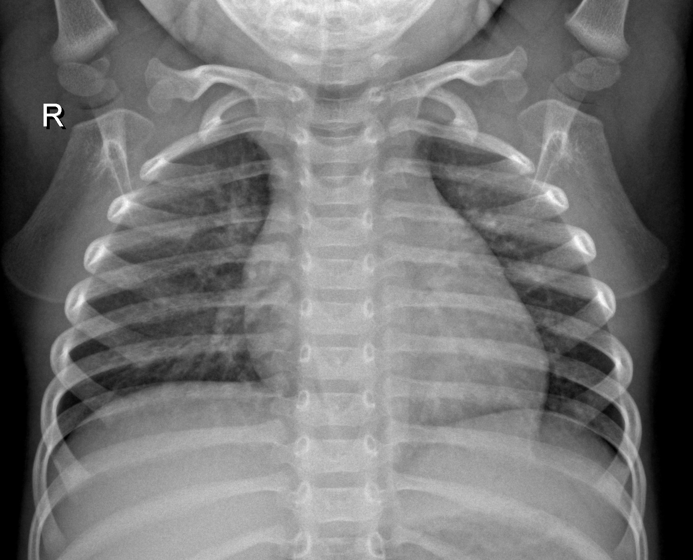

# Pneumonia Detection from Chest X-rays

This project leverages deep learning to classify chest X-ray images and detect the presence of pneumonia.

## Table of Contents

- [Overview](#overview)
- [Installation and Setup](#installation-and-setup)
- [Usage](#usage)
- [Results](#results)
- [Acknowledgements](#acknowledgements)

## Overview

Pneumonia is an inflammatory condition of the lung affecting primarily the small air sacs known as alveoli. Early detection of pneumonia through X-rays can significantly improve treatment efficacy. This project implements a Convolutional Neural Network (CNN) model using TensorFlow to classify chest X-ray images as 'Normal' or 'Pneumonia'.

## Installation and Setup

1. **Clone the repository:**

```bash
git clone https://github.com/Tamaghnatech/pneumonia-detection.git
```

2. **Navigate to the directory:**

```bash
cd pneumonia-detection
```

3. **Set up a virtual environment (optional but recommended):**

```bash
python3 -m venv env
source env/bin/activate
```

4. **Install required packages:**

```bash
pip install -r requirements.txt
```

(Note: This assumes that you have a `requirements.txt` file with necessary packages.)

## Usage

1. **Data Preparation:**
   - Place normal chest X-ray images in `/content/normal`
   - Place pneumonia chest X-ray images in `/content/pneumonia`

2. **Training:**
   - Run the Jupyter Notebook or Python script to initiate the training process. The model will be saved as `pneumonia_classifier.h5`.

3. **Evaluation:**
   - Use the provided evaluation script or Jupyter cells to evaluate the model's performance on the test set.

## Results

The model achieved an accuracy of 91.91% on the test set. A confusion matrix provides further details on the model's performance:

(Insert confusion matrix image here)

## Acknowledgements

- Dataset source: [Chest X-Ray Images (Pneumonia)](https://www.kaggle.com/paultimothymooney/chest-xray-pneumonia) from Kaggle
- Thanks to [TensorFlow](https://www.tensorflow.org/) for the deep learning framework.

## MIT License

Copyright (c) [2023] [Tamagha Nag]

Permission is hereby granted, free of charge, to any person obtaining a copy
of this project and associated documentation files, to deal
in the project without restriction, including without limitation the rights
to use, copy, modify, merge, publish, distribute, sublicense, and/or sell
copies of the Software, and to permit persons to whom the Software is
furnished to do so, subject to the following conditions:

The above copyright notice and this permission notice shall be included in all
copies or substantial portions of the Software.

---
